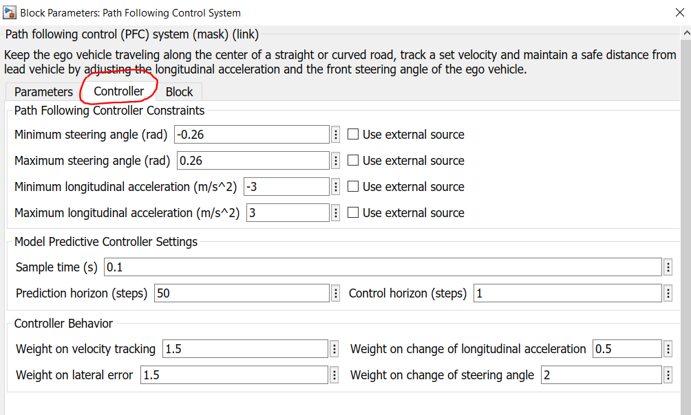
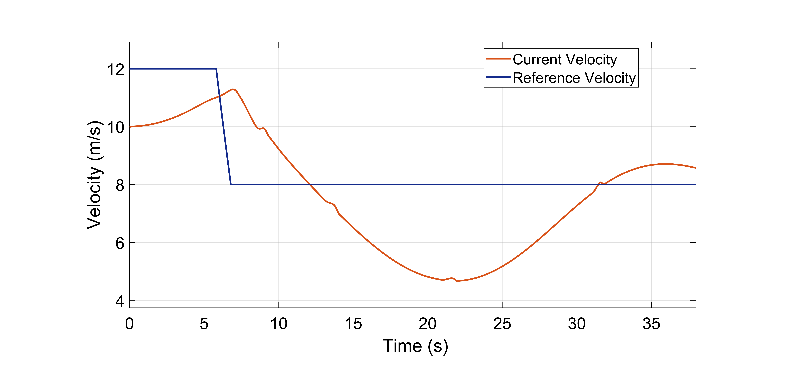
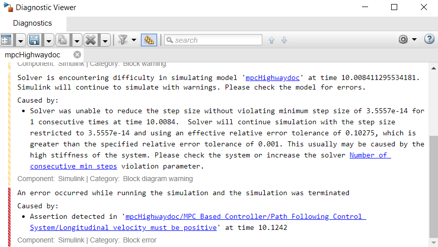
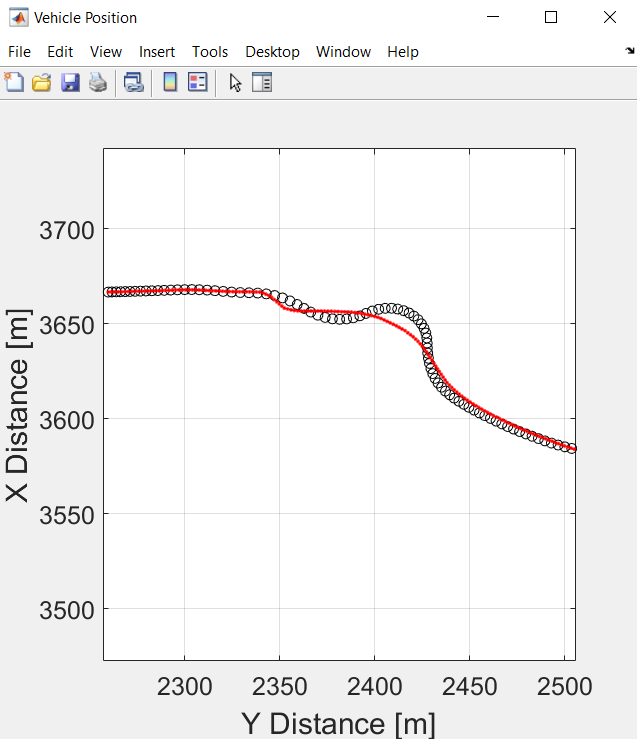

# Vehicle Path Tracking Using Model Predictive Control (MPC)

This submission contains a model to show the implementation of MPC on a vehicle moving in a US Highway scene. Steps below describe the workflow:
1. Generating waypoints
2. Calculating curvature for MPC implementation
3. Generating MPC pedal map
4. Visualizing vehicle final path in 2D, Bird's-Eye Scope and a 3D simulation environment. 

The users can refer this model to perform path tracking applications for a given waypoints. The results can be visualized in a 2D plot that compares the obtained and the reference trajectory.

## Folders
1_MPC_Figure_Eight: Contains model to implement a mpc to drive the vehicle through a figure eight course with a constant velocity. 

2_MPC_USHighway: Contains a model to implements a mpc to drive the vehicle through the US Highway scene.

## Model

### mpcEightCourse.slx
The model implements a model predictive control to drive the vehicle through a figure eight course. 

### mpcHighway.slx
The model implements a model predictive control to drive the vehicle through the US Highway scene.

## Supporting files and folders (Before running the model, please make sure all these files are in the current folder)

### Images
The folder contains images for masking certain blocks in the model

### setUpModel.m
The file initializes the parameters required  to run the model

### USHighway.mat
The file contains data for the US Highway scene

### velocityDistributionHighway.xlsx
The file is used to generate a lookup table for the velocity distribution

## Product Requirements

The models are developed in MATLAB R2020b version and use the following MathWorks products:
1. Aerospace Blockset 
2. Automated Driving Toolbox
3. Curve Fitting Toolbox
4. MATLAB
5. Model Predictive Control Toolbox
6. Simulink
7. Simulink Coder
8. Statistics and Machine Learning Toolbox
9. Vehicle Dynamics Blockset

## About the model
The model shows the implementation of MPC on a vehicle moving in a US Highway scene:
- It comprises of a vehicle dynamics model based on a 3 DOF rigid two-axle vehicle body and a simplified powertrain and driveline. The vehicle dynamics model has been taken from one of the reference applications titled, [Scene Interrogation with Camera and Ray Tracing Reference Application](https://www.mathworks.com/help/vdynblks/ug/scene-interrogation-reference-application.html). For more detailed vehicle dynamics models, please check out the [Vehicle Reference Applications](https://www.mathworks.com/help/vdynblks/examples.html?category=index&s_tid=CRUX_topnav).
- The model uses an Excel spreadsheet to define the reference velocity
- The mat file contains the waypoints for the US Highway scene exported from the Driving Scenario Designer
- The MPC based controller outputs steering, acceleration, and deceleration commands to track the reference trajectory
- The model displays the vehicle motion in the 2D plot, 3D Unreal Engine US highway scene, and in Bird's-Eye Scope  

## How to run the model?

Open and run the mpcHighway.slx model. The model automatically loads the setUpModel.m file that initializes the  parameters required  to run the model. Note: Before running the model, please make sure that all the supporting files are in the "Current Folder." 

## How to use the model?

Please note that the model has been tuned for a given set of waypoints and a velocity map. In case, you wish to customize it for a different test case, here are the steps to be followed:
1. **Define a waypoint vector:** If you want the vehicle to follow a different trajectory, use the Driving Scenario Designer to define the waypoints. In case, you already have the waypoints, make sure to call the x and y coordinates using the “setUpModel” script.

2. **Define a velocity target map:** Based on the waypoints, please define the velocities in different regions (x and y coordinates) in the “Velocity Distribution Lookup Table” that accepts from the “velocityDistributionHighway” spreadsheet. 
3. **Define stop time:** Please run the simulation once and adjust the stop time in the “setUpModel” script to make sure that the vehicle stops after it has reached the last waypoint.

4. **Tune the model:** Please note that MPC uses a model of the system to make predictions about the system’s future behavior. It solves an online optimization algorithm to find the optimal control action that drives the predicted output to the reference. Hence, it is important to tune the parameters in the "Path Following Control System" block to get the desired output. To learn more about MPC, please refer to this MATLAB Teck Talk: [Understanding Model Predictive Control](https://www.mathworks.com/videos/series/understanding-model-predictive-control.html) 

## Tips for selecting the Model Predictive Control design parameters 

Choosing appropriate Model Predictive Control design parameters is necessary to track the reference trajectory. These parameters are defined in the “Path Following Control System” block under the “Controller” section.

 

Here are a few tips to guide you through the selection of these design parameters:
1. **Sample time:** By choosing the sample time, we determine the rate at which the controller executes the control algorithm. If it’s too big, the controller won’t be able to react to the turns fast enough. The figure below shows the effect of choosing a higher value. 
On the contrary, if the sample time is too small, the controller can react much faster to disturbances and setpoint changes, but this causes an excessive computational load.

 

2. **Prediction horizon (steps):** The number of predicted future steps governs how far the controller predicts into the future. Let’s see what happens if it is too short. 
In the current model, the vehicle has to reduce the velocity when it approaches the turn. However, due to a lower prediction horizon, the controller is unable to predict the velocity, and the result delayed braking that leads to a deviation of the vehicle path from the reference trajectory. 

 

Hence, we should select the prediction horizon such that it considers the significant dynamics of the system.

3. **Control horizon (steps):** Each control move in the control horizon can be thought of as a free variable that needs to be computed by the optimizer. So, the smaller the control horizon, the fewer the computations. However, it might not always give the expected maneuvering. On the other hand, increasing the control horizon will improve the result but will certainly increase the complexity. A good option is to set the control horizon value to 10 to 20 % of the prediction horizon.

The other important parameters that are necessary to be tuned properly, are the weights. In the block, we need to define the weights for velocity tracking, lateral error, longitudinal acceleration, and steering angle. To know more on how to select the weights please follow the documentation of the block. However, the thumb rule is to decide what we want from the controller. For example, in the current model, our priority is to steer the vehicle to follow the track. Hence, we have selected a higher weight for lateral error and change of steering angle. In case, you change the priority to follow the reference velocity, you will need to increase the weights related to the longitudinal motion. However, make sure that the reference velocity map is built taking into consideration the sharp turns in the path.

## Troubleshooting the model

Now that we have seen the significance of selecting control parameters, let’s try to see how these can be used to solve the issues while running the model. Let’s assume that you want to increase the velocity of the vehicle. For that, we add a “Gain” block of magnitude 3, after the “Velocity Distribution Lookup Table” block. ]

 

When you run the simulation, it will fail at around 10 seconds displaying the below error:

 

If you click on the hyperlink, it will point you to one of the blocks in the “Path Following Control Systems” block that says that the “Longitudinal velocity must be positive.” 

 

This means that the controller is unable to maintain a positive vehicle velocity. One possible reason could be that the controller is unable to make future predictions of the vehicle’s velocity. So, we increase the prediction horizon steps from 50 to 60 and now we can see that the simulation doesn’t fail. This was one of the ways to resolve the issue. However, the tracking is not proper. 

 

Now, to further improve the results we will need to tune the velocity map. The reason is that when we multiply the velocity by 3, the vehicle velocity increase from 30 km/hr to 86.4 km/hr which is a quite higher value at the turn. Hence, it should be noted that the reference vehicle velocity map is important when we want to drive at a higher velocity. Further, if we change the velocity map, accordingly we have also tuned the controller, constraints, weights, and control parameters. 
So, the above tips and tricks would help you tune your model. In case of further queries, please reach out to us at racinglounge@mathworks.com. 

Copyright 2020 The MathWorks, Inc.

